# Steel Surface Defect Detection

Deep-learning project for detecting and segmenting defects on steel surfaces using the Severstal Steel Defect Detection dataset. The project takes an input image and predicts a binary pixel mask identifying defective regions.

The complete workflow is implemented in [Steel-surface-detection.ipynb](Steel-surface-detection.ipynb).

## Project Goals

- Load steel-surface images and their run-length encoded defect annotations.
- Convert annotations into binary segmentation masks.
- Train a neural network to localize defective pixels.
- Evaluate predictions with segmentation and pixel-level classification metrics.
- Visualize predictions, overlays, training curves, and Grad-CAM explanations.
- Provide a reusable single-image inference function.

## Dataset

This notebook is based on the Kaggle Severstal Steel Defect Detection dataset.

The notebook expects the following directory structure:

```text
severstal-steel-defect-detection/
├── train.csv
├── train_images/
│   ├── image_1.jpg
│   └── ...
└── test_images/
    ├── image_2.jpg
    └── ...
```

The CSV file contains image IDs, defect class IDs, and run-length encoded masks in the `EncodedPixels` column. The original images have a height of 256 pixels and a width of 1600 pixels.

By default, the notebook uses this Kaggle path:

```python
DATA_PATH = "/kaggle/input/competitions/severstal-steel-defect-detection"
```

Update `DATA_PATH` when running locally or from another environment.

## Technologies

- **Python** for the project implementation.
- **PyTorch** for datasets, model definitions, training, optimization, and inference.
- **Torchvision** for the pretrained ResNet34 encoder.
- **OpenCV** for image loading and color conversion.
- **NumPy** and **Pandas** for numerical operations and annotation processing.
- **Albumentations** for image and mask augmentation.
- **scikit-learn** for stratified splitting and evaluation metrics.
- **SciPy** for estimating the epoch needed to reach a target Dice score.
- **Matplotlib** and **Seaborn** for plots and visual analysis.
- **tqdm** for training and validation progress bars.

## Workflow

### 1. Reproducibility and configuration

The notebook seeds Python, NumPy, and PyTorch random generators with seed `42`. It selects CUDA when available and otherwise uses the CPU.

Main defaults:

| Setting                     |       Value |
| --------------------------- | ----------: |
| Image size                  | `256 x 256` |
| Batch size                  |        `48` |
| Initial learning rate       |      `1e-3` |
| Maximum epochs              |        `30` |
| Minimum epochs              |         `5` |
| Early-stopping patience     |         `7` |
| Plateau patience            |         `4` |
| Binary prediction threshold |       `0.5` |

The ResNet34 training call uses a learning rate of `1e-4`.

### 2. Train/validation split

The annotation table is first reduced to one row per image. An image is labeled as containing a defect when at least one annotation has a non-null `EncodedPixels` value.

The split is:

- 80% training images
- 20% validation images
- Stratification by whether an image contains a defect
- Fixed `random_state=42`

### 3. RLE mask decoding

The `rle_decode` function converts the dataset's run-length encoded annotations into binary segmentation masks. `build_mask` combines all annotated defect regions for an image with a pixel-wise logical OR.

Although the dataset includes defect classes, the current project merges every defect class into one foreground class. The task is therefore binary segmentation:

- `0`: background / no defect
- `1`: defect

### 4. Image preprocessing and augmentation

Training images use the following transformations:

- Resize to `256 x 256`
- Random horizontal flip
- Random vertical flip
- Random rotation up to 15 degrees
- Random brightness and contrast adjustment
- Gaussian noise
- ImageNet mean and standard-deviation normalization
- Conversion to PyTorch tensors

Validation and inference use resizing and ImageNet normalization without random augmentation. Image and mask transformations are applied together so their spatial alignment is preserved.

### 5. Dataset and data loaders

`SteelSegDataset` loads an image, decodes its combined mask, applies the selected Albumentations pipeline, and returns:

- Image tensor with shape `(3, H, W)`
- Mask tensor with shape `(1, H, W)`

Training data is shuffled, while validation data is not shuffled.

## Models

The notebook defines two segmentation architectures.

### Baseline U-Net

The scratch `UNet` model contains:

- Three encoder blocks
- A bottleneck block
- Three decoder blocks
- Max-pooling for downsampling
- Transposed convolutions for upsampling
- Skip connections between encoder and decoder stages
- A one-channel output layer

This model is included as a baseline architecture but is not trained by the current execution path.

### ResNet34 U-Net

The main experiment uses `ResNetUNet`:

- A pretrained ResNet34 encoder from Torchvision
- ResNet feature maps reused as skip-connection features
- Transposed-convolution decoder blocks
- A final bilinear upsampling step
- A one-channel output mask

The output is a logit map. Applying a sigmoid converts it to per-pixel defect probabilities.

## Loss Function

Training uses a weighted combination of binary cross-entropy and Dice loss:

```text
total loss = 0.3 * BCEWithLogitsLoss + 0.7 * DiceLoss
```

The BCE term uses `pos_weight=3.0`, which gives additional importance to positive defect pixels and helps reduce missed defects.

Dice loss is computed from sigmoid probabilities and is useful for the class-imbalance and region-overlap nature of segmentation.

## Smart Training Strategy

The `smart_train` function combines several mechanisms to avoid wasting epochs:

- **ReduceLROnPlateau** reduces the learning rate when validation Dice stops improving.
- **EarlyStopping** saves the best model checkpoint and stops after seven epochs without meaningful improvement.
- **PlateauPruner** detects a flat rolling Dice improvement.
- The run can stop after three learning-rate reductions with no gain.
- Training never stops from these smart controls before the minimum epoch count.
- **EpochPredictor** fits a saturation curve to the validation Dice history and estimates whether the target Dice of `0.80` may be reached.
- Automatic mixed precision is enabled when training on CUDA.
- Gradient norms are clipped to `1.0`.

The main training call saves the best ResNet34 U-Net weights to `resnet.pth`.

## Evaluation

The notebook calculates and visualizes:

- Validation loss
- Validation Dice score
- Pixel accuracy
- Precision
- Recall
- F1 score
- Pixel-level confusion matrix

The validation predictions use a sigmoid probability threshold of `0.5`.

### Important metric note

Pixel accuracy can look high when most pixels are background. Dice, precision, recall, and F1 are more informative for judging defect localization, especially when defects occupy a small part of an image.

## Visualizations and Explainability

The notebook produces:

- Defect versus no-defect distribution
- Defect class distribution from the source annotations
- Example images and ground-truth masks
- Mask pixel-count distribution
- Training and validation loss curves
- Validation Dice curve
- Prediction-versus-ground-truth grids
- Red prediction overlays and green ground-truth overlays
- Grad-CAM heatmaps from the final ResNet encoder convolution
- A project summary dashboard

Generated files include:

```text
images/defect_presence_distribution.png
images/defect_class_distribution.png
images/sample_images_and_masks.png
images/mask_pixel_distribution.png
images/train_val_curves.png
images/training_history.png
images/pred_vs_gt_grid.png
images/prediction_overlay.png
images/gradcam.png
images/validation_metrics.png
images/confusion_matrix.png
images/dashboard.png
```

## Running the Notebook

1. Download the Severstal Steel Defect Detection dataset.
2. Place it at the configured `DATA_PATH`, or update that variable.
3. Install the required Python packages.
4. Open `Steel-surface-detection.ipynb` in Jupyter or VS Code.
5. Run the cells from top to bottom.

Example installation command:

```bash
pip install numpy pandas matplotlib opencv-python torch torchvision scikit-learn tqdm scipy albumentations seaborn jupyter
```

For GPU training, install the PyTorch build appropriate for the CUDA version available on the machine. The notebook automatically falls back to CPU when CUDA is unavailable.

## Single-Image Inference

After loading or training `resnet`, call `predict_single_image` with an image path:

```python
mask, probability_map, defect_ratio = predict_single_image(
    "path/to/image.jpg",
    resnet,
    threshold=0.5,
)
```

The function:

1. Loads and normalizes the image.
2. Generates a per-pixel probability map.
3. Converts probabilities into a binary mask.
4. Calculates the percentage of pixels classified as defective.
5. Displays the input image, predicted mask, and red defect overlay.
6. Returns the mask, probability map, and defect-pixel ratio.

The function can serve as the model layer behind a Flask or FastAPI endpoint, but the notebook does not currently include a web API.

## Loading a Saved Model

```python
resnet = ResNetUNet()
resnet.load_state_dict(
    torch.load("resnet.pth", map_location=DEVICE, weights_only=True)
)
resnet = resnet.to(DEVICE)
resnet.eval()
```

## Limitations and Possible Improvements

- The dataset path is hard-coded and must be changed outside Kaggle.
- The project merges all four source defect categories into one binary class, so it cannot identify the specific defect type.
- The original wide images are resized directly to a square, which can distort geometry.
- Only one validation split is used; cross-validation would provide a more robust estimate.
- The scratch U-Net is defined but not benchmarked against the ResNet34 U-Net in the current notebook.
- Threshold `0.5` is fixed; it could be tuned using validation data for a desired precision-recall tradeoff.
- The notebook visualizes predictions but does not export masks to a production annotation format.
- Training results depend on the hardware, PyTorch version, pretrained-weight availability, and dataset state.

Useful next steps include multiclass segmentation, aspect-ratio-preserving preprocessing, test-set inference, threshold calibration, experiment tracking, and packaging inference behind an API.

## Project Structure

```text
CVprojects/
├── Steel-surface-detection.ipynb   # Data preparation, training, evaluation, and inference
├── README.md                        # Project documentation
├── resnet.pth                       # Generated best model checkpoint
└── images/                          # Generated visualization outputs
```

The generated model and image files appear only after the corresponding notebook cells have been executed.

## Visualization Gallery

### Dataset exploration

| Defect presence | Defect classes |
| --- | --- |
| 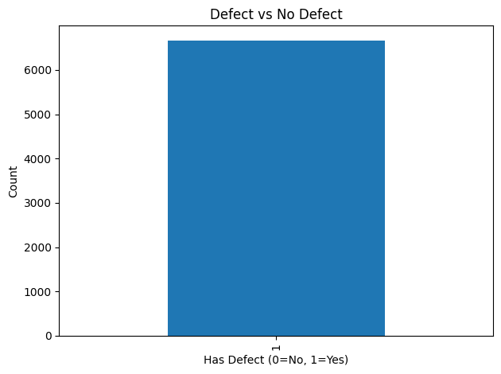 | 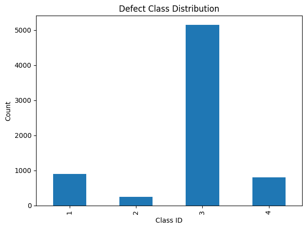 |

| Sample images and masks | Mask pixel distribution |
| --- | --- |
| 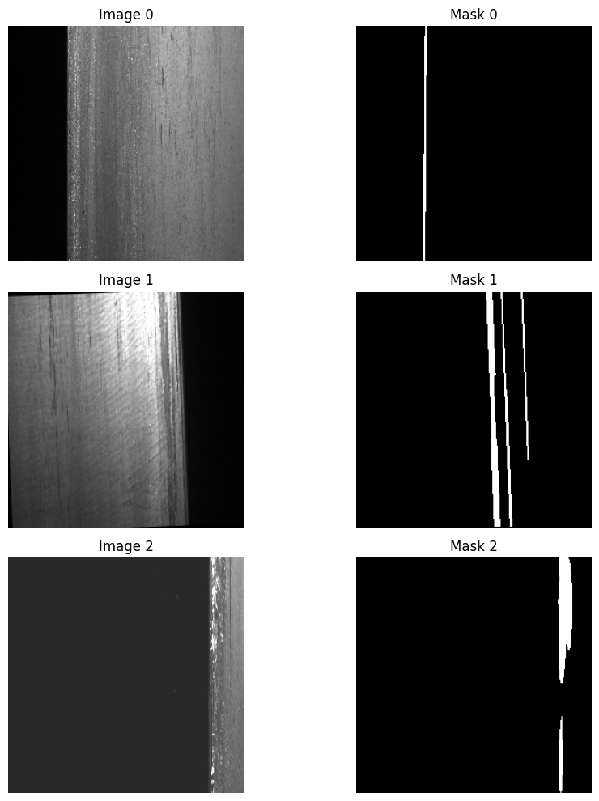 | 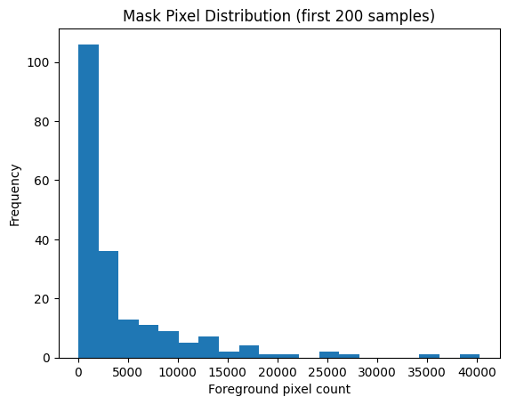 |

### Training and evaluation

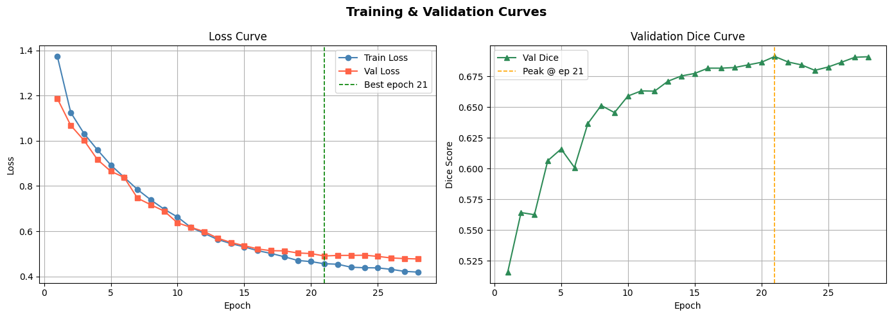

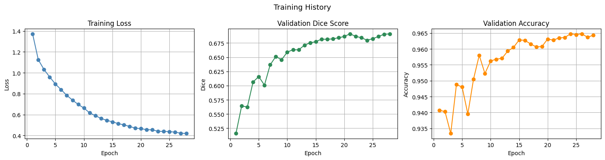

| Validation metrics | Confusion matrix |
| --- | --- |
| 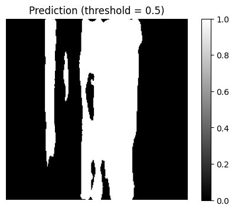 | 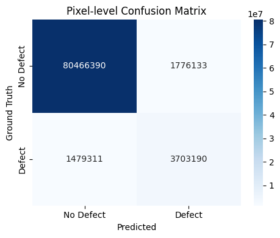 |

### Predictions and explainability

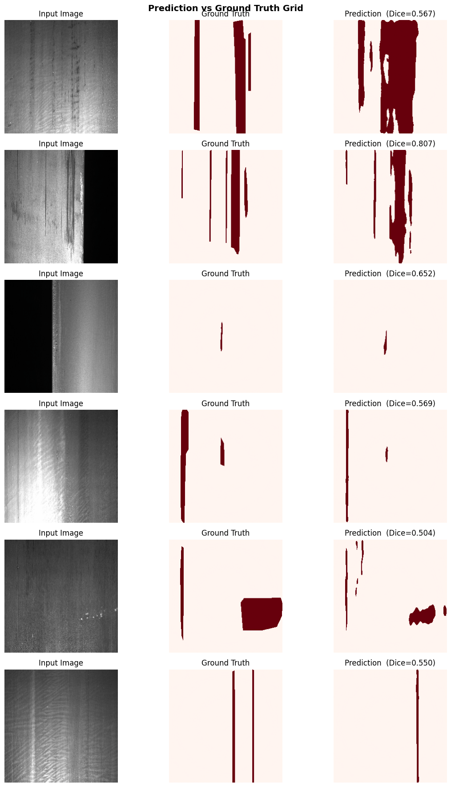

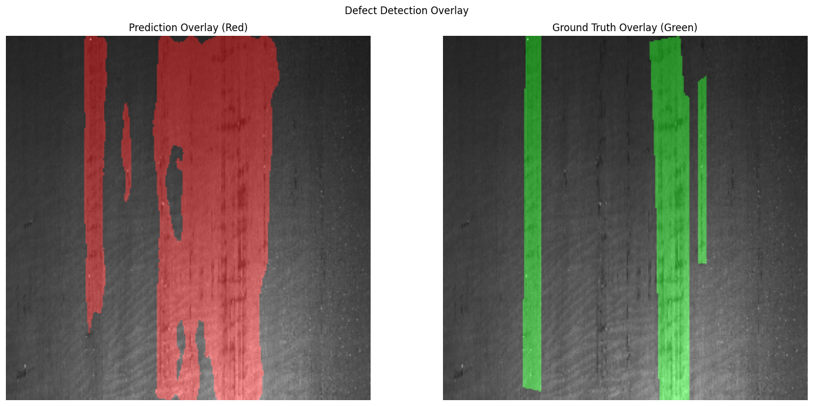

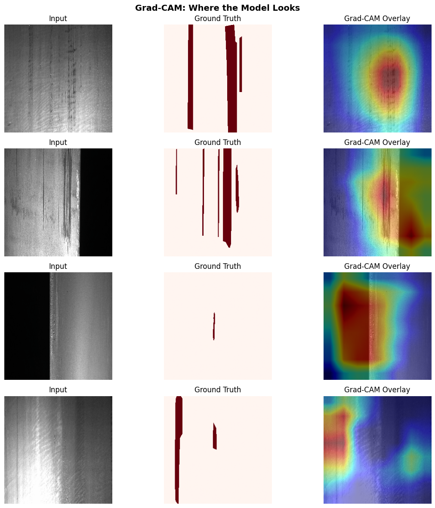

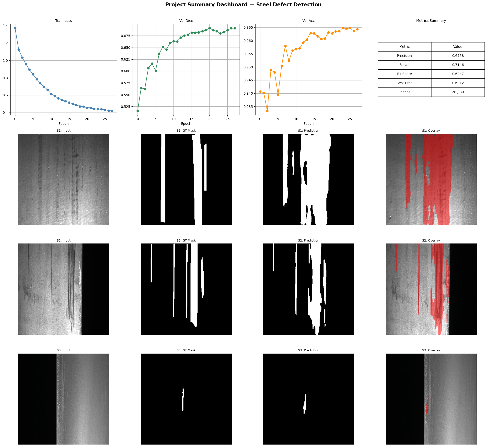
